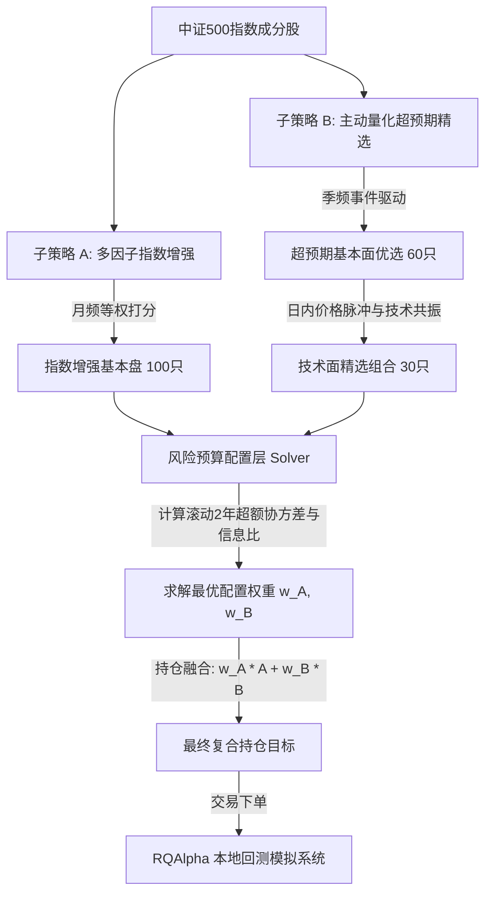

# 基于风险预算的中证500指数增强复合策略
> Guosen CSD 500 Index Enhancement Strategy based on Risk Budgeting Model

本项目是对国信证券金融工程经典研究报告 **《基于风险预算的中证500指数增强策略》** 的量化研究复现与本地仿真框架。策略旨在打破公募增强基金同质化及基本面因子选股能力边际衰减的困境，通过资产配置的视角，利用风险预算（Risk Budgeting）模型将主动量化选股与传统多因子增强有机复合。

*   **研究思路来源**：[【国信金工】基于风险预算的中证500指数增强策略 (微信公众号原文)](https://mp.weixin.qq.com/s/1tC88dO9AqBOH4sS0a5hkg)

---

## 💡 思路来源与量化背景

### 1. 传统多因子指数增强模型的困境
近年来，以中证500指数为代表的宽基指数增强需求井喷。目前主流的增强基金普遍采用 **“基本面多因子选股 + barra风险控制 + 截面组合优化”** 的方式构建。
然而，随着参与资金规模的增加，这类中低频多因子框架面临两个严重瓶颈：
*   **因子同质化严重**：主流因子在截面上的相关性不断提升，交易拥挤。
*   **选股能力边际衰减**：自2017年以来，传统基本面因子的截面 IC 均值及组合信息比率（Information Ratio）呈现明显的趋势性下滑。仅靠添加若干个基本面因子无法扭转这一系统性趋势。

### 2. 主动量化组合的异质性 Alpha 优势
与多因子选股不同，主动量化策略（本项目中为 **“业绩超预期精选组合”**）通过聚焦财报盈余漂移效应（PEAD）：
*   筛选在季报披露期“研报标题超预期”与“分析师全线上调净利润”的事件股池。
*   配合技术面共振指标（如 52周最高价距离、非预期换手、开盘跳空 AOG 等）精选个股。
*   该主动量化策略超额收益空间巨大（回测历史年化超额超过40%），且与传统多因子增强组合的超额收益**长期相关性较低（在 0.35 附近）**，能够形成极佳的异质性 Alpha 补充。

### 3. 基于风险预算的策略复合逻辑
主动选股组合虽然超额收益率极高，但由于持股集中（仅 30 只），面临回撤大、跟踪误差高的问题，无法直接作为指数增强组合。
本项目采用 **“策略复合（资产配置）”** 的思路解决此冲突：
*   将 **“多因子指数增强组合”** 和 **“超预期精选组合”** 视为两个独立的子资产。
*   利用**跟踪误差预算模型（Tracking Error Budgeting）**进行权重调配。
*   设置风险预算目标比例：**分配比例正比于两个策略滚动 2 年信息比的平方（$IR^2$）**。
*   引入子策略超额收益的协方差矩阵，动态解出资金权重 $w_A$ 和 $w_B$，从而在不明显降低信息比、不显著扩大跟踪误差的约束下，最大化复合增强组合的超额回报。

---

## 📈 核心模型设计架构

### 1. 子策略 A：多因子指数增强底盘
*   **频率**：月频调仓（月末最后一个交易日）。
*   **因子维度**：覆盖估值（E/P, B/P）、成长（净利润同比增速）、盈利（ROE）。对因子进行截面去极值与标准化，选择得分前 100 只作为组合 A。

### 2. 子策略 B：超预期精选主动策略
*   **频率**：季频调仓（每年 1、4、7、8、10 月末，紧跟财报披露窗口）。
*   **第一步（基本面优选）**：剔除单季净利润增速 $\le 0$ 的股票，利用标准化预期外盈利（`SUE`）、ROE、及分析师上调评级比例等权打分，筛选前 60 只基本面优选池。
*   **第二步（技术面精选）**：在 60 只股票中，利用 `52周最高价距离`、`非预期换手`、`市值对数(负向)`、`公告次日开盘跳空超额(AOG)` 及 `公告后3日超额` 5 个因子打分，精选前 30 只等权买入。

### 3. 配置优化：风险预算（跟踪误差预算）求解
*   在每个月的月底，计算并追加两个子组合上个月实际取得的超额收益率（$R_{excess} = R_{strat} - R_{bench}$）。
*   若回测历史记录满 24 个月，则启动优化求解器：
    *   计算滚动 2 年的历史月度超额收益协方差矩阵 $\Sigma$。
    *   风险预算目标比：
        $$Budget_A : Budget_B = IR_A^2 : IR_B^2$$
    *   构建非线性最优化问题，求解权重向量 $w = [w_A, w_B]^T$：
        $$\text{Minimize} \quad \sum_{i \in \{A, B\}} \left( \frac{w_i (\Sigma w)_i}{w^T \Sigma w} - \tilde{b}_i \right)^2$$
        $$\text{Subject to} \quad w_A + w_B = 1, \quad w_i \ge 0$$
        （其中 $\tilde{b}$ 为归一化的风险预算目标比例）。
    *   若历史数据不足 24 个月，则采用常数配置比例（79% A + 21% B）作为冷启动过渡。
*   **持仓融合**：个股最终目标持仓权重为两子组合权重之加权合并。

---

## 💎 项目亮点与价值
1.  **自适应风险重构**：当多因子增强策略在市场同质化浪潮下超额能力衰退时，配置权重会动态且灵敏地向主动超预期选股组合倾斜，以平滑净值曲线并弥补收益。
2.  **严谨无未来函数**：基本面快照完全基于披露日期（`pub_date`）定位，策略回溯历史超额收益均采用已发生的价格，符合真实的实盘交易决策流程。
3.  **资产配置与事件驱动的融合**：将微观的事件驱动选股（PEAD）抽象为子策略，结合宏观资产配置模型（风险预算）实现统一框架回测，为宽基指数增强方案提供了全新的演进维度。
